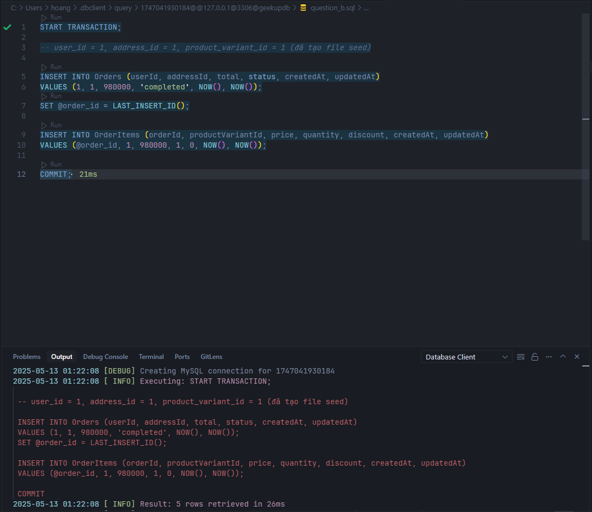
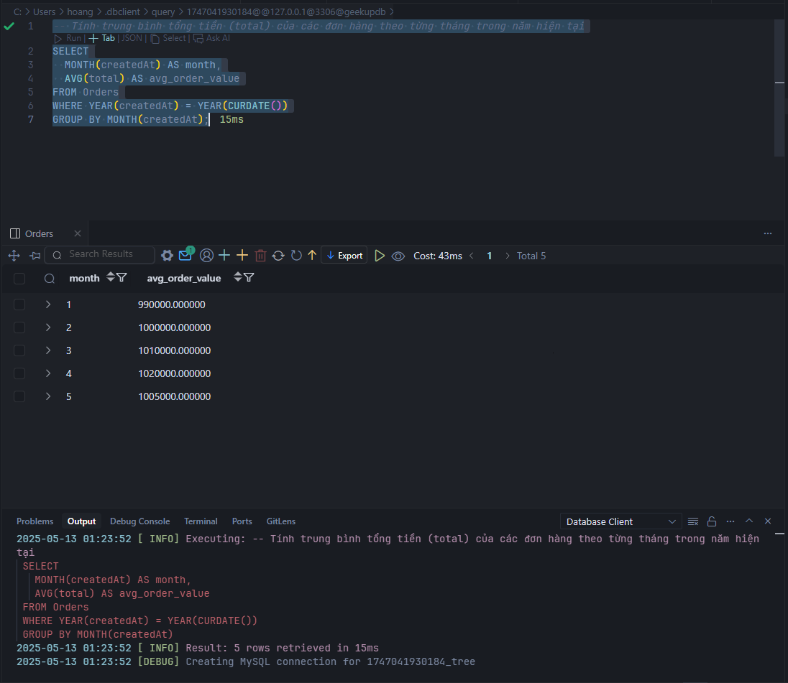
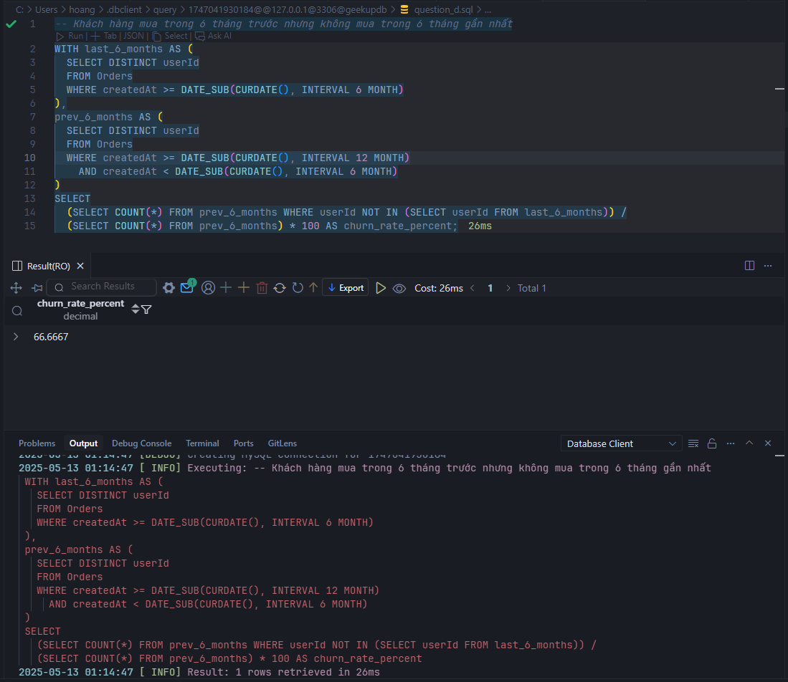
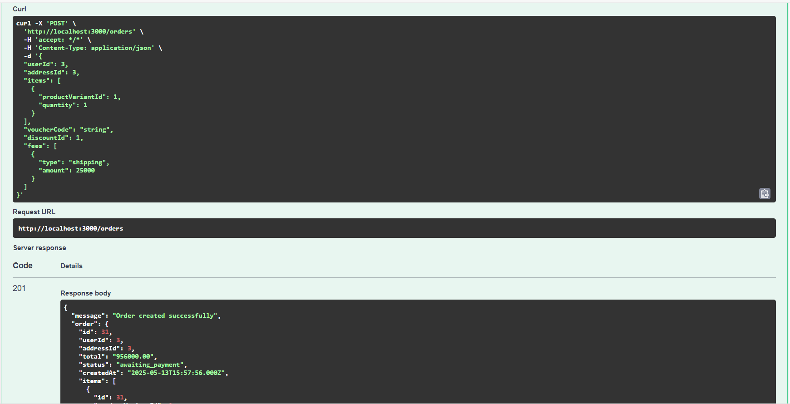
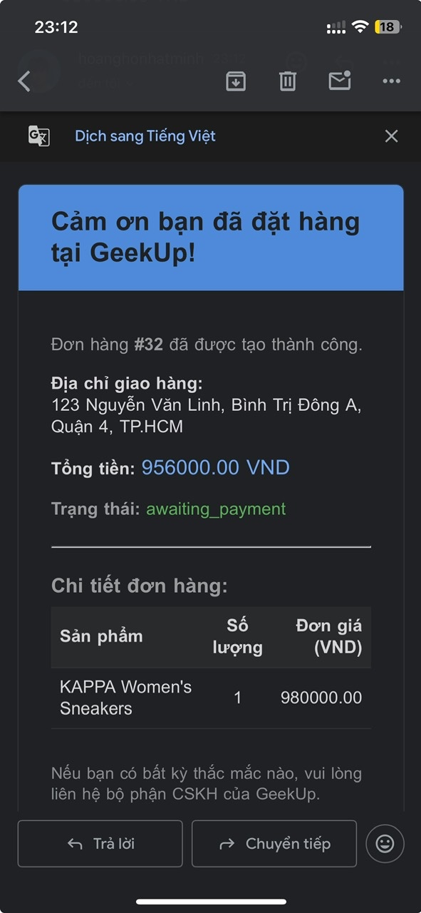
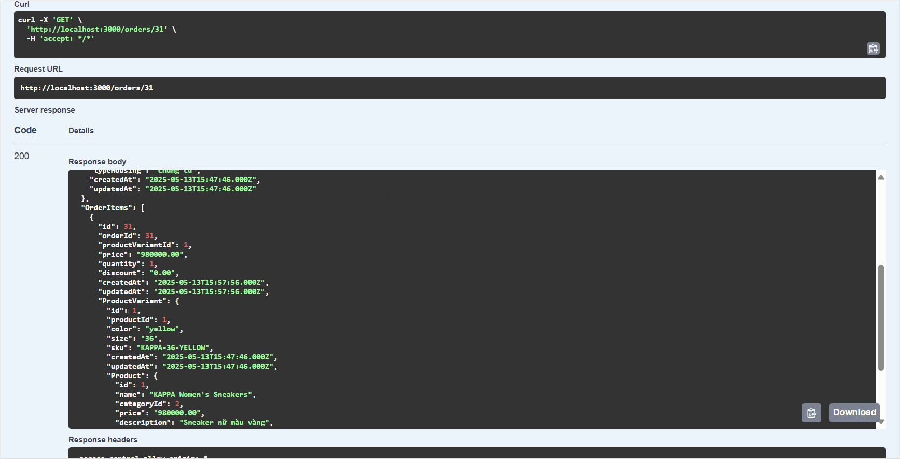
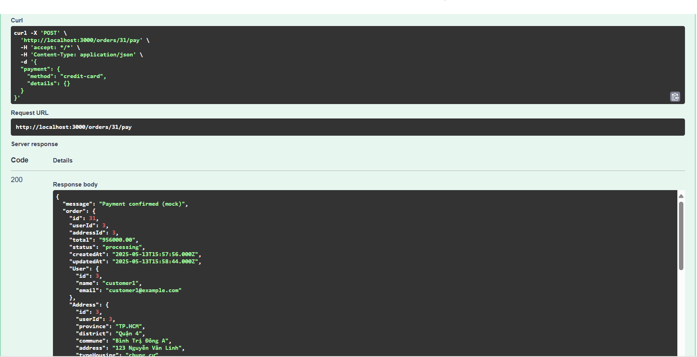
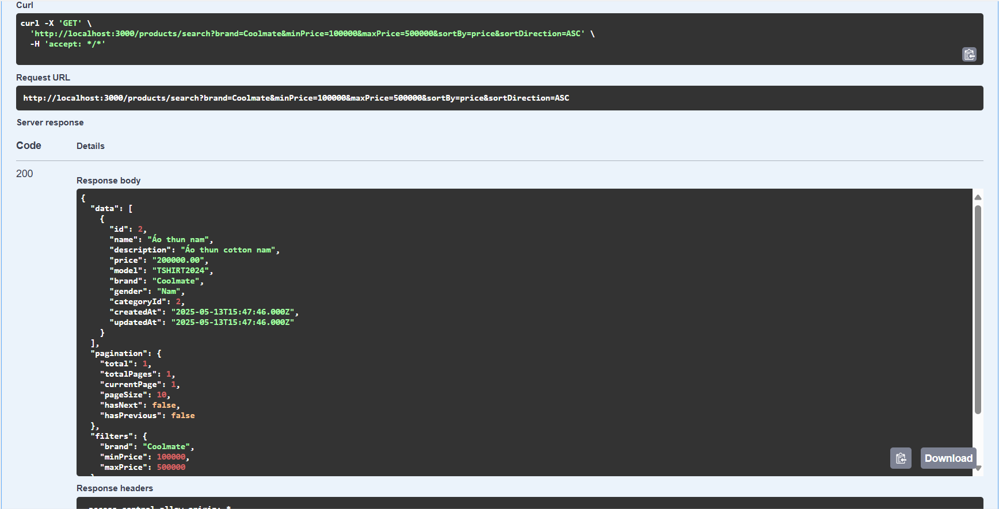
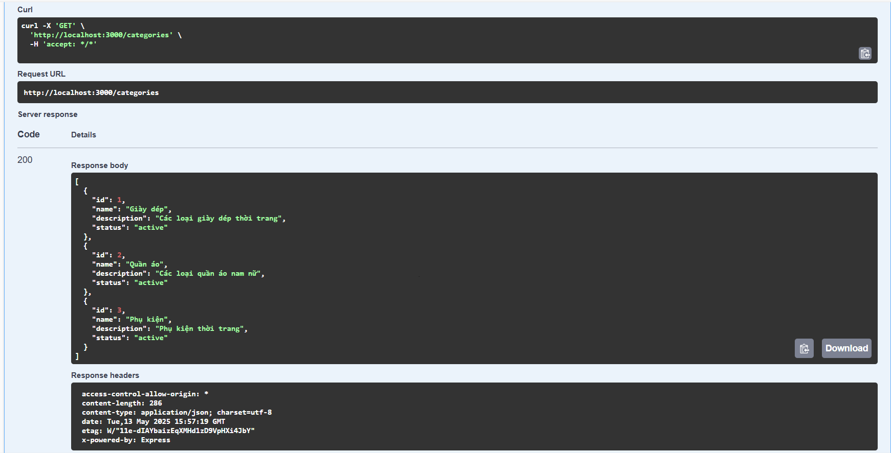
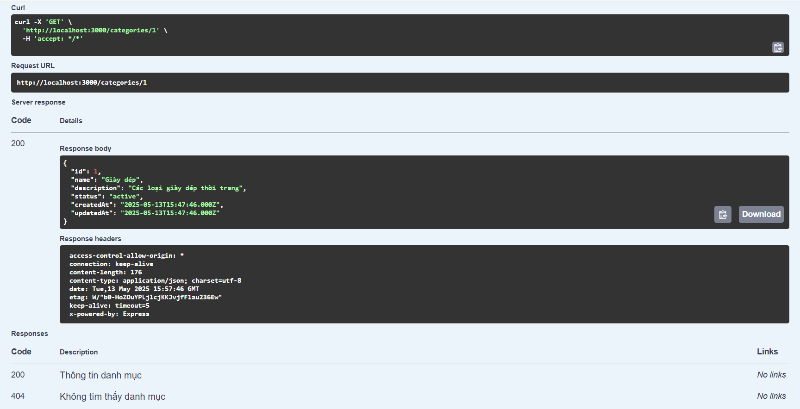

# GeekUp E-commerce Backend

---

## Table of Contents

1. [Project Structure](#project-structure)
2. [Installation & Setup](#installation--setup)
3. [Database Design & Normalization](#database-design--normalization)
4. [SQL Queries](#sql-queries)
5. [Run & Usage](#run--usage)
6. [API Documentation (Swagger UI)](#api-documentation-swagger-ui)
7. [Notes](#notes)

---

## Project Structure

```
├── app.js                # Main Express app
├── server.js             # Server entry point
├── swagger.js            # Swagger/OpenAPI config
├── package.json
├── .env copy             # Example environment variables
├── README.md
├── create_db.js          # Script to create database
├── config/               # Database config
├── models/               # Sequelize models
├── migrations/           # Sequelize migrations
├── seeders/              # Seed data for development
├── controllers/          # Route controllers
├── services/             # Business logic (Order, Payment, Email, ...)
├── routes/               # API route definitions
├── images/               # Query result images (for documentation)
└── node_modules/
```

---

## Installation & Setup

### 1. Install dependencies

```sh
npm install
```

### 2. Initialize MySQL with Docker (recommended for development)

```sh
docker run --name mysql-geekup -e MYSQL_ROOT_PASSWORD=yourpassword -p 3306:3306 -d mysql:8
```

- Replace `yourpassword` with your desired root password.
- Make sure port 3306 is not used by another application.

### 3. Database Connection Setup

- Create a `.env` file in the root directory with the following content:
  ```env
  DB_HOST=localhost
  DB_PORT=3306
  DB_USER=root
  DB_PASSWORD=yourpassword
  DB_NAME=geekupdb
  EMAIL_USER=your_gmail@gmail.com
  EMAIL_PASS=your_gmail_app_password
  ```
- Ensure the MySQL container is running (`docker ps`).

### 4. Create Database (if not exists)

- **Method 1: Manually via MySQL shell:**
  - Connect to the MySQL container:
    ```sh
    docker exec -it mysql-geekup mysql -u root -p
    ```
  - In the MySQL shell, create the database:
    ```sql
    CREATE DATABASE geekupdb CHARACTER SET utf8mb4 COLLATE utf8mb4_unicode_ci;
    ```
- **Method 2: Automatically via NodeJS script:**
  - Run the provided script:
    ```sh
    node create_db.js
    ```
  - This script will automatically create the `geekupdb` database if it does not exist, using the information from the `.env` file.

### 5. Run Migrations to Create Tables

```sh
npx sequelize-cli db:migrate
```

### 6. Seed Mock Data into Database

```sh
npx sequelize-cli db:seed:all
```

---

## Database Design & Normalization

### Main Tables

- **Users**: Stores user information (id, name, email, phone, password, type)
- **Addresses**: Stores user shipping addresses (id, userId, province, district, commune, address, typeHousing)
- **Categories**: Product categories (id, name, description)
- **Products**: Products (id, name, categoryId, price, description, model, brand, gender)
- **ProductVariants**: Product variants (id, productId, color, size, sku)
- **Stores**: Stores (id, name, address)
- **Inventories**: Store inventory for each product variant (id, storeId, productVariantId, quantity)
- **Orders**: Orders (id, userId, addressId, total, status, createdAt, ...)
- **OrderItems**: Order details (id, orderId, productVariantId, price, quantity, discount)
- **Vouchers**: Discount codes (id, code, description, discountPercent, ...)
- **UserVouchers**: Links vouchers to users (id, userId, voucherId, used)
- **OrderVouchers**: Links vouchers to orders (id, orderId, voucherId)
- **Payments**: Payments (id, orderId, method, status, amount)
- **Fees**: Fees (id, orderId, type, amount)
- **Discounts**: Discounts by category/product (id, categoryId, productId, percent, ...)

### Normalization Applied

- **1NF (First Normal Form)**: Each field is atomic, no repeating groups, no arrays or objects in a field.
- **2NF (Second Normal Form)**: Each table has a primary key, and all non-key attributes are fully functionally dependent on the primary key.
- **3NF (Third Normal Form)**: No transitive dependencies, all attributes are only dependent on the primary key.

### Relationships

- One user can have multiple addresses (1-n)
- A product belongs to one category (n-1)
- A product can have multiple variants (1-n)
- A product variant can be available in multiple stores (n-n, via inventories table)
- An order belongs to one user and one address (n-1)
- An order has multiple order_items (1-n)
- A user can have multiple vouchers (n-n)
- An order can apply multiple vouchers (n-n)
- An order can have multiple types of fees (1-n)
- An order has one payment (1-1)

---

## SQL Queries

### a) Insert a sample order for user "assessment"

```sql
START TRANSACTION;
-- user_id = 1, address_id = 1, product_variant_id = 1 (created in seed file)
INSERT INTO Orders (userId, addressId, total, status, createdAt, updatedAt)
VALUES (1, 1, 980000, 'completed', NOW(), NOW());
SET @order_id = LAST_INSERT_ID();
INSERT INTO OrderItems (orderId, productVariantId, price, quantity, discount, createdAt, updatedAt)
VALUES (@order_id, 1, 980000, 1, 0, NOW(), NOW());
COMMIT;
```



### b) Calculate the average order value per month in the current year

```sql
SELECT
  MONTH(createdAt) AS month,
  AVG(total) AS avg_order_value
FROM Orders
WHERE YEAR(createdAt) = YEAR(CURDATE())
GROUP BY MONTH(createdAt);
```



### c) Calculate customer churn rate

```sql
WITH last_6_months AS (
  SELECT DISTINCT userId
  FROM Orders
  WHERE createdAt >= DATE_SUB(CURDATE(), INTERVAL 6 MONTH)
),
prev_6_months AS (
  SELECT DISTINCT userId
  FROM Orders
  WHERE createdAt >= DATE_SUB(CURDATE(), INTERVAL 12 MONTH)
    AND createdAt < DATE_SUB(CURDATE(), INTERVAL 6 MONTH)
)
SELECT
  (SELECT COUNT(*) FROM prev_6_months WHERE userId NOT IN (SELECT userId FROM last_6_months)) /
  (SELECT COUNT(*) FROM prev_6_months) * 100 AS churn_rate_percent;
```



---

## Run & Usage

### Start the Application

```sh
npm run dev
```

- Or:

```sh
node server.js
```

---

## API Documentation (Swagger UI)

- After starting the server, visit: [http://localhost:3000/api-docs](http://localhost:3000/api-docs)
- The Swagger UI provides full interactive API documentation and allows you to try requests directly from the browser.

### Main API Groups

#### Orders

- **POST /orders**: Create a new order (with items, address, fees, voucher, etc.)

  
  

- **GET /orders/{id}**: Get order details by order ID

  

- **POST /orders/{orderId}/pay**: Confirm payment for an order

  

#### Products

- **GET /products/search**: Search for products with full-text search, filters (brand, model, gender, price range), pagination, and sorting

  

#### Categories

- **GET /categories**: Get all product categories

  

- **GET /categories/{id}**: Get category details by ID

  

**For full request/response schemas and more endpoints, see the Swagger UI.**

---

## Notes

- If you encounter errors during seeding, check the seed order and foreign key data.
- If you change migrations, rollback and migrate again from the beginning.
- If using Docker, you can stop the container with `docker stop mysql-geekup` when not in use.
